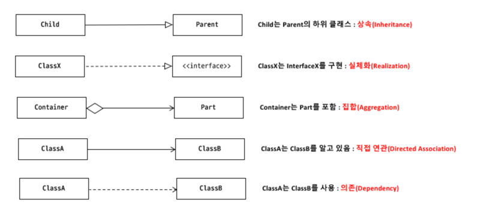
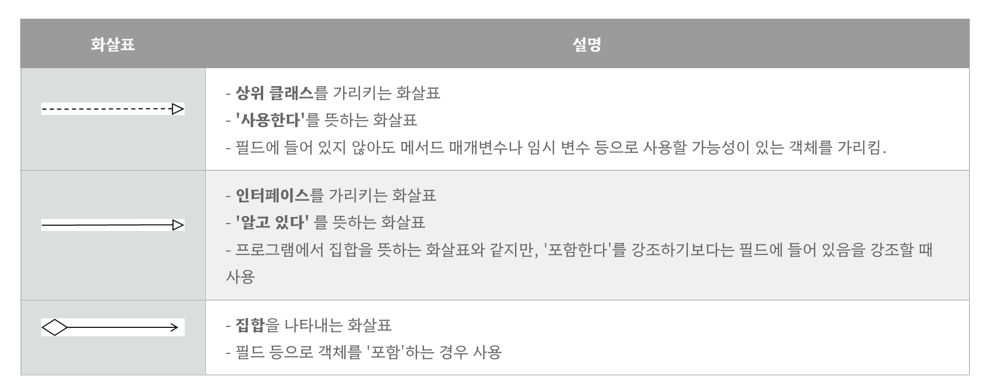
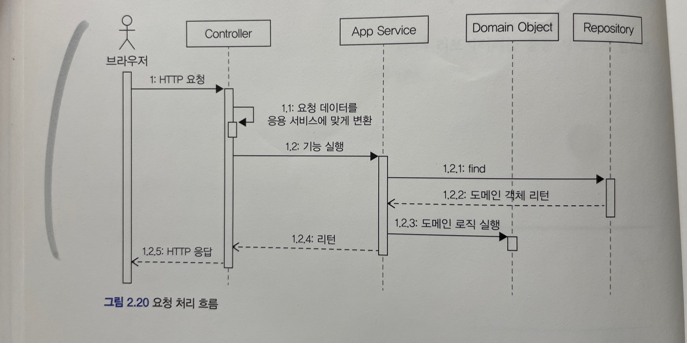

# DDD-DomainDrivenDesign
[Book]도메인 주도 개발 시작하기(DDD 핵심 개념 정리부터 구현까지), 최범균

 

# CH 01 : 도메인 모델 시작하기

## 1.2 : 도메인 전문가와 개발자 간 지식 공유
- 개발자는 요구사항을 분석하고 설계하여 코드를 작성하며 테스트 및 배포를 실행한다. 이 과정에서 요구사항은 첫 단추와 같다.
- 요구사항을 제대로 이해하지 않으면 쓸모없거나 유용함이 떨어지는 시스템을 만들기 때문이다.

 

## 1.3 : 도메인 모델
- 도메인 모델은 특정 도메인을 개념적으로 표현한 것이다.
- 도메인을 이해하려면 도메인이 제공하는 기능과 도메인의 주요 데이터 구성을 파악해야 한다. 이를 가장 잘 보여줄 수 있는 모델이 바로 객체 모델이다.
- 객체 모델 외에도 상태 다이어그램, 클래스 다이어그램 등 UML 표기법을 사용하여 표현할 수도 있다.

 

## 1.4 : 도메인 모델 패턴
- 일반적인 애플리케이션 아키텍쳐는 Presentation, Application, Domain, Infrastructure 이렇게 4가지 영역으로 구성된다.
  - Presentation(사용자 인터페이스 또는 표현) : 사용자의 요청을 처리하고 사용자에게 정보를 보여준다. 여기서 사용자는 소프트웨어를 사용하는 사람뿐만 아니라 외부 시스템일 수도 있다.
  - Application(응용) : 상용자가 요청한 기능을 실행한다. 업무 로직을 직접 구현하지 않으며 도메인 계층을 조합해서 기능을 실행한다.
  - Domain : 시스템이 제공할도메인 규칙을 구현한다.
  - Infrastructure : 데이터베이스나 메시징 시스템과 같은 외부 시스템과의 연동을 처리한다. 

- 마틴 파울러의 "엔터프라이즈 애플리케이션 아키텍처 패턴" 책의 도메인 모델 패턴
  - 이 책의 도메인 모델은 아키텍쳐 상의 도메인 계층을 객체 지향 기법으로 구현하는 패턴을 말한다.
  - 도메인 모델에서 중요한 점은 도메인과 관련된 중요 업무 규칙을 도메인 모델에서 구현한다는 점이다.
  - 핵심 규칙을 구현한 코드는 도메인 모델에만 위치하기 때문에 규칙이 바뀌거나 규칙을 확장해야 할 때 다른 코드에 영향을 덜 주고 변경 내역을 모델에 반영할 수 있게 된다.

 

## 1.5 : 도메인 모델 도출
- 아무리 뛰어난 개발자라도 도메인에 대한 이해 없이 코딩을 시작할 수 없다. 기획서, 유스케이스, 사용자 스토리와 같은 요구사항과 관련자와의 대호를 통해 도메인을 이해하고 이리ㅡㄹ 바탕으로 도메인 모델 초안을 만들어야 비로소 코드를 작성할 수 있다.
- 어떤 툴을 사용하든 도메인에 대한 초기 모델이 필요하다
- 도메인을 모델링할 때 기본이 되는 작업은 모델을 구성하는 핵심 구성요소, 규칙, 기능을 찾는 것이다. 이 과정은 요구사항에서 출발한다.
- 요구사항을 토대로 명명 규칙, 상태, 제약 규칙, 기능 등을 도출하여 코드에 반영한다.

> 문서화  
문서화를 하는 주된 이유는 지식을 공유하기 위함이다. 실제 구현은 코드에 있으므로 코드를 보면 다 알 수 있지만 코드는 상세한 모든 내용을 다루고 있기 때문에 코드를 이용해서 전체 소프트웨어를 분석하려면 많은 시간을 투자해 야 한다.전반적인 기능 목록이나 모듈 구조, 빌드 과정은 코드를 보고 직접 이해하는 것보다 상위 수준에서 정리한 문서를 참조하는 것이 소프트웨어 전반을 빠르게 이해하는 데 도움이 된다. 전체 구조를 이해하고 더 깊게 이해할 필 요가 있는 부분을 코드로 분석해 나가면 된다.
코드를 보면서 도메인을 깊게 이해하게 되므로 코드 자체도 문서화의 대상이 된다. 도메인 지식이 잘 묻어나도록 코 드를 작성하지 않으면 코드의 동작 과정은 해석할 수 있어도 도메인 관점에서 왜 코드를 그렇게 작성했는지 이해하 는 데는 도움이 되지 않는다. 단순히 코드를 보기 좋게 작성하는 것뿐만 아니라 도메인 관점에서 코드가 도메인을 잘 표현해야 비로소 코드의 가독성이 높아지고 문서로서 코드가 의미를 갖는다.

 

## 1.6 : 엔티티와 밸류
- 도출한 모델은 크게 엔티티(Entity)와 밸류(Value)로 구분할 수 있다.
- 엔티티(Entity)
  - 엔티티의 가장 큰 특징은 식별자를 가진다는 것이다.
  - 엔티티의 식별자는 바뀌지 않는다. 엔티티를 생성하고 속성을 바꾸고 삭제할 때까지 식별자는 유지된다.
  - 엔티티의 식별자는 바뀌지 않고 고유하기 때문에 두 엔티티 객체의 식별자가 같으면 두 엔티티는 같다고 판단할 수 있다. 엔티티를 구현한 클래스는 식별자를 이용해서 equals(), hashCode() 메서드를 구현할 수 있다.
- 엔티티의 식별자 생성
  - 특정 규칙에 따라 생성
    - 주문번호, 운송자번호, 카드번호와 같은 식별자는 특정 규칙에 따라 생성한다. 흔히 현재 시간과 다른 값을 조합하여 사용한다. 
  - UUID나 Nano ID와 같은 고유 식별자 생성기 사용
  - 값을 직접 입력
    - 회원의 아이디나 이메일과 같은 식별자는 값을 직접 입력한다. 
  - 일련번호 사용(시퀀스나 DB의 자동 증가 컬럼 사용)
    - 자동증가 컬럼은 DB 테이블에 데이터를 삽입해야 비로소 값을 알 수 있기 때문에 테이블에 데이터를 추가하기 전까지 식별자를 알 수 없다.
    - 이는 엔티티 객체를 생성할 때 식별자를 전달할 수 없음을 의미한다.
    - 하지만 리포지터리(repository)에서 DB가 생성한 식별자를 구해서 엔티티 객체에 반영하기 때문에 크게 신경쓰지 않아도 된다.
- 밸류 타입
   - 밸류 타입은 개념적으로 완전한 하나를 표현할 때 사용한다. 밸류 타입을 사용하면 개념적으로 완전한 하나를 잘 표현할 수 있다.
   - 밸류 타입을 따로 사용하는 경우 밸류 타입을 위한 기능을 추가할 수도 있다.
   - 밸류 객체의 데이터를 변경할 때는 기존 데이터를 변경하기보다는 변경한 데이터를 갖는 새로운 밸류 객체를 생성하는 방식을 선호한다.
   - 데이터의 변경 기능을 제공하지 않는 타입을 불변(immutable)이라고 표현하는데 밸류 타입을 불변으로 구현하면 좋다. 가장 큰 이유는 안전한 코드를 작성할 수 있다는 것이다.
   - 두 밸류 객체를 비교할 때는 equals() 메소드를 이용해 모든 속성이 같은지 비교한다.
- 엔티티 식별자와 밸류 타입
  - 식별자는 단순한 문자열이 많은데, 단순한 문자열이 아니라 도메인에서 특별한 의미를 지니는 밸류 타입을 사용해 그 의미가 잘 드러나도록 할 수 있다.
- Setter 사용
  - Setter를 사용하게 되면 도메인 객체가 불완전한 상태로 사용된다. 
  - 이를 막기 위해 생성 시점에 필요한 것을 전달해 주어야 한다. 즉, 생성자를 통해 필요한 데이터를 모두 받자.
  - 불변 밸류 타입을 사용하면 자연스럽게 밸류 타입에 set 메서드를 구현하지 않게 된다.

 

## 1.7 : 도메인 용어와 유비쿼터스 언어
- 도메인 용어를 최대한 반영하면 코드를 도메인 용어로 해석하거나 도메인 용어를 코드로 해석하는 과정이 줄어든다.
- 코드의 가독성을 높여서 코드를 분석하고 이해하는 시간을 줄여준다.
- 최대한 도메인 용어를 사용해서 도메인 규칙을 코드로 ㅈ가성하게 되므로(의미를 변환하는 과정에서 발생하는) 버그도 줄어든다.
- 에릭 에반스는 도메인 주도 설ㄱ계에서 언어의 중요함을 강조하기 위해 유비쿼터스 언어(ubiquitous language)라는 용어를 사용했다.
  - 해당 도메인 개발과 관련된 공통의 언어를 만들어 소통 과정에서 발생하는 용어의 모호함을 줄일 수 있고 개발자는 도메인과 코드 사이에서 불필요한 해석 과정을 줄일 수 있다.
  - 도메인 용어는 좋은 코드를 만드는 데 매우 중요한 요소이지만 대부분 영어로 되어 있다. 
  - 각 단어의 뉘앙스나 미세한 차이를 이해하고 알맞은 단어를 사용하기 위해 영어 공부를 꼭 해야 할 것이다.

 

 

# CH 02 : 아키텍처 개요

## 2.1 : 네 개의 영역
- 표현, 응용, 도메인, 인프라스트럭처는 아키텍처를 설계할 때 출현하는 전형적인 네 가지 영역이다.
  - 표현(UI 영역) 
    - 사용자의 요청을 받아 응용 영역에 전달하고 응용 영역의 처리 결과를 다시 사용자에게 보여주는 역할을 한다. 웹 애플리케이션의 스프링 MVC 프레임워크가 표현 영역을 위한 기술에 해당한다.
    - 웹 애플리켕션의 표현 영역은 HTTP 요청을 응용 영역이 필요로 하는 형식으로 변환해서 응용 영역에 전달하고 응용 영역의 응답을 HTTP 응답으로 변환하여 전송한다.
    - 표현 영역을 통해 사용자의 요청을 전달받는 응용 영역은 시스템이 사용자에게 제공해야 할 기능을 구현한다.
  - 응용 영역
    - 기능을 구현하기 위해 도메인 영역의 도메인 모델을 사용한다.
    - 응용 서비스는 로직을 직접 수행하기보다는 도메인 모델에 로직 수행을 위임한다.
  - 도메인 영역
    - 도메인 모델을 구현한다.
    - 도메인 모델은 도메인의 핵심 로직을 구현한다.
  - 인프라스트럭처
    - 구현 기술에 대한 것을 다룬다.
    - RDBMS 연동을 처리하고 메세징 큐에 메시지를 전송하거나 수신하는 기능을 구현한다.
    - 몽고DB나 레디스와 데이터의 연동을 처리한다.
    - SMTP를 이용한 메일 발송 기능을 구현하거나 HTTP 클라이언트를 이용해서 REST API를 호출하는 것도 처리한다.

 

## 2.2 : 계층 구조 아키텍처
- 네 영역을 구성할 때 많이 사용하는 아키텍쳐는 계층 구조이다.
- 계층구조는 그 특성상 상위계층(표현)에서 하위 계층(인프라스트럭처)으로의 의존만 존재하고 하위 계층은 상위 계층에 의존하지 않는다.
  - 표현 계층은 응용 계층에 의존하지만 응용 계층은 표현 계층에 의존하지 않는다.
- 계층 구조를 엄격하게 적용한다면 상위 계층은 바로 아래의 계층에만 의존을 가져야 하지만 구현의 편리함을 위해 계층 구조를 유연하게 적용하기도 한다. 예를 들면 응용계층에서 바로 인프라스트럭처를 의존하는 것이다. 
- 하지만 이렇게 표현, 응용, 도메인 계층이 상세한 구현 기술을 다루는 인프라스트럭처 계층에 종속된다는 문제가 있다.
- 이렇게 인프라스트럭처에 의존하게 되면 "테스트를 하기 어려움"과 "구현 방식을 변경(기능 확장)의 어려움"이라는 문제가 있다.
- 이에 대한 해답은 DIP에 있다.

 

## 2.3 : DIP
- 고수준 모듈은 의미 있는 단일 기능을 제공하는 모듈이다.
- 저수준 모듈은 고수준 모듈의 하위 기능을 실제로 구현한 것이다.
- 2.2에서의 문제점은 고수준 모듈이 저수준 모듈을 사용하면서 발생한 문제이다. 이를 해결하기 위해 DIP를 사용해 저수준 모듈이 고수준 모듈에 의존하도록 바꾼다
- 그렇다면 저수준 모듈이 고수준 모듈에 의존하도록 하려면 어떻게 해야할까? 비밀은 추상화한 인터페이스에 있다.
- 인터페이스(고수준 모듈)을 상속해 실제 구현한 클래스(저수준 모듈)을 사용하면 저수준 모듈이 고수준 모듈에 의존하게 된다.
- 이처럼 저수준 모듈이 고수준 모듈을 의존한다고 해서 DIP(Dependency Inversion Priciple), 의존 역전 원칙이라 한다.
- 스프링과 같은 의존 주입을 지원하는 프레임워크를 사용하면 설정 코드를 수정해서 쉽게 구현체를 변경할 수 있다. 인터페이스를 대역 객체를 사용해 테스트를 진행할 수 있게 된 것이다.
- 실제 구현 없이 테스트를 할 수 있는 이뉴는 DIP를 적용해서 고수준 모듈을 저수준 모듈에 의존하지 않도록 했기 때문이다.

### 주의사항
  - DIP를 잘못 생각하면 단순히 인터페이스와 구현 클래스를 분리하는 정도로 받아들일 수 있다.
  - DIP의 핵심은 고수준 모듈이 저수준 모듈에 의존하지 않도록 하기 위함이다.
- DIP와 아키텍처
  - 인프라스트럭처 영역은 구현 기술을 다루는 저수준 모듈이고 응용, 도메인 영역은 고수준 모듈이다. DIP를 적용하면 인프라스트럭처 영역이 응용 영역과 도메인 영역에 의존(상속)하는 구조가 된다.
  - 인프라스트럭처에 위치한 클래스가 도메인이나 응용 영역에 정의한 인터페이스를 상속받아 구현하는 구조가 되므로 도메인과 응용 영역에 대한 영향을 주지 않거나 최소화하면서 구현 기술을 변경하는 것이 가능하다.

 

## 2.4 : 도메인 영역의 주요 구성요소
- 도메인 영역의 모델은 도메인의 주요 개념을 표현하며 핵심 로직을 구현한다.
- 엔티티와 밸류 타입은 도메인 영역의 주요 구성요소이다.
- Entity
  - 고유의 식별자를 갖는 객체로 자신의 라이프 사이클을 갖는다.
- Value
  - 고유의 식별자를 갖지 않는 객체로 주로 개념적으로 하나의 값을 표현할 때 사용된다.
  - 엔티티의 속성으로 사용할 뿐만 아니라 다른 밸류 타입의 속성으로도 사용할 수 있다.
- Aggregate(애그리거트)
  - 애그리거트는 연관된 엔티티와 밸류 객체를 개념적으로 하나로 묶은 것이다.
  - 도메인 모델에서 전체 구조를 이해하는 데 도움이 되는 것이 바로 애그리거트이다.
  - 애그리거트는 관련 객체를 하나로 묶은 군집이다.
  - 애그리거트는 군집에 속한 객체를 관리하는 루트 엔티티를 닺는다. 루트 엔티티는 애그리거트에 속해 있는 엔티티와 밸류 객체를 이용해서 애그리거트가 구현해야 할 기능을 제공한다.
  - 애그리거트를 사용하는 코드는 항상 애그리거트 루트가 제공하는 기능을 실행하고 애그리거트 루트를 통해 간접적으로 애그리거트 내의 다른 엔티티나 밸류 객체에 접근한다.
    - 이를 통해 애그리거트의 내부 구현을 숨겨서 애그리거트 단위로 구현을 캡슐화할 수 있도록 돕는다.
- Repository
  - 도메인 모델의 영속성을 처리한다.
  - 애그리거트 단위로 도메인 객체를 저장하고 조회하는 기능을 정의한다.
- Domain Service
  - 특정 엔티티에 속하지 않은 도메인 로직을 제공한다.
  - 도메인 로직이 여러 엔티티와 밸류를 필요로 하면 도메인 서비스에서 로직을 구현한다.

### 주의사항
  - 실제 도메인 모델의 엔티티와 DB 관계형 모델의 엔티티는 같은 것이 아니다.
  - 두 모델의 가장 큰 차이점은 도메인 모델의 엔티티는 데이터와 함께 도메인 기능을 하메 제공한다는 점이다.
  - 도메인 모델의 엔티티는 간순히 데이터를 담고 있는 데이터 구조라기보다는 데이터와 함게 기능을 함께 제공하는 객체이다.
  - 도메인 모델의 엔티티는 두 개 이상의 데이터가 개념적으로 하나인 경우 밸류 타입을 이용해서 표현할 수 있다.
  - 밸류는 불변으로 구현할 것을 권장하며, 이는 엔티티의 밸류 타입 데이터를 변경할 때 객체 자체를 완전히 교체한다는 것을 의미한다.

 

## 2.5 : 요청의 흐름

 

## 2.6 : 인프라스트럭쳐 개요
- 인프라스트럭쳐는 표현, 응용, 도메인 영역을 지원한다.
- DIP를 무조건적으로 적용할 필요는 없다.
  - DIP가 주는 편리함과 변경의 유연함, 테스트하기 쉬움 등 장점만큼 구현의 편리함 또한 중요하기 때문에, DIP의 장점을 해치지 않는 범위에서 응용 영역과 도메인 영역에서 구현 기술에 대한 의존을 가져가는 것이 나쁘지 않다고 생각한다.
  - 좋은 예시가 바로 스프리으이 @Transactional, @Entity, @Table 등이 있다.

 

## 2.7 : 모듈 구성
- 도메인 모듈은 도메인에 속한 애그리거트를 기준으로 다시 패키지를 구성한다.
- 애그리거트, 모델, 리포지터리는 같은 패키지에 위치시킨다.
- 복잡하다면 도메인 별로 패키지를 구분할 수 있다.

 

 

# CH 03 : 애그리거트

## 3.1 : 애그리거트
- 주요 도메인 요소 간의 관계를 파아하기 어렵다는 것은 코드를 변경하고 확장하는 것이 어려워진다는 것을 의미한다.
- 복잡한 도메인을 이해하고 관리하기 쉬운 단위로 만들려면 상위 수준에서 모델을 조망할 수 있는 방법이 필요하다. 그것이 바로 애그리거트이다.
- 애그리거트는 복잡한 도메인을 단순한 구조로 만들어준다.
- 애그리거트는 관련된 모델을 하나로 모았기 때문에 한 애그리거트에 속한 객체는 유사하거나 동일한 라이프 사이클을 갖는다.
  - 애그리거트에 속한 구성요소는 대부분 함께 생성하고 함께 제거한다.
- 애그리거트는 독립된 객체 군이며 각 애그리거트는 자기 자신을 관리할 뿐 다른 애그리거트를 관리하지 않는다.
- 경계를 설정할 때 기본이 되는 것은 도메인 규칙과 요구사항이다. 도메인 규칙에 따라 함께 생성되는 구성요소는 한 애그리거트에 속한 가능성이 높다. 또한 함꼐 변경되는 빈도가 높은 객체는 한 애그리거트에 속한 가능성이 높다.

### 주의사항
- 흔히 A가 B를 갖는다로 설계할 수 있는 요구사항이 있다면 A와 B를 한 애그리거트로 묶어서 생각하기 쉽다.
- 하지만 A가 B를 갖는다로 해석할 수 있는 요구사항이 있더라도 이것이 반드시 A와 B가 한 애그리거트에 속한다는 것을 의미하는 것이 아니다.
  - 좋은 예시가 바로 상품과 리뷰다.
  - 상품 상세 페이지에 들어가면 상품 상세 정보와 함께 리뷰 내용을 보여줘야하는 요구사항이 있다. 하지만 상품과 리뷰는 함께 생성되지도 않고 함께 변겨오디지도 않는다. 따라서 서로 다른 애그리거트에 속한다.
  
 

## 3.2 : 애그리거트 루트
- 도메인 규칙을 지키려면 애그리거트에 속한 모든 객체가 정상 상태를 가져야 한다.
- 애그리거트에 속한 모든 객체가 일관된 상태를 유지하려면 애그리거트 전체를 관리할 주체가 필요한데, 바로 애그리거트의 루트 엔티티이다.
- 애그리거트 루트
  - 애그리거트가 제공해야 할 도메인 기능을 구현한다.
  - 애그리거트 루트가 제공하는 메서드는 도메인 규칙에 따라 애그리거트에 속한 객체의 일관성이 깨지지 않도록 구현해야 한다.

### 트랜잭션 범위
- 트랜잭션 범위는 작을수록 좋다. 한 트랜잭션이 한 개 테이블을 수정하는 것과 세 개의 테이블을 수정하는 것을 비교하면 성능에서 차이가 발생한다.
  - 또한 한 개 테이블을 수정하면 트랜잭션 충돌을 막기 위해 잠그는 대상이 한 개 테이블의 행으로 한정되지만, 여러개일 경우 잠금 대상이 많아진다.
  - 잠금 대상이 많아진다는 것은 그만큼 동시에 처리할 수 있는 트랜잭션 개수가 줄어든다는 것을 의미하고 이것은 전체적인 성능(처리량)을 떨어뜨린다.
- 한 트랜잭션에서는 한 개의 애그리거트만 수정해야 한다.
  - 한 트랜잭션에서 두 개 이상의 애그리거트를 수정하면 트랜잭션 충돌이 발생할 가능서이 높아진다.
  - 애그리거트가 자신의 책임 범위를 넘어 다른 애그리거트의 상태까지 관리하는 꼴이 된다.
  - 애그리거트는 쵣한 서로 독립적이어야 한다. 만약 부득이하게 한 트랜잭션으로 두 개 이상의 애그리거트를 수정해야 한다면, 애그리거트에서 다른 애그리거트를 직접 수정하지 말고 응용 서비스(Application)에서 두 애그리거트를 수정하도록 구현해야 한다.

### 주의사항
- 애그리거트 외부에서 애그리거트에 속한 객체를 직접 변경하면 안 된다. 이것은 애그리거트 루트가 강제하는 규칙을 적용할 수 없어 모델의 일관성을 깨는 원인이 된다.
- 즉 논리적인 데이터 일관성이 깨지게 되는 것이다.
- 불필요한 중복을 피하고 애그리거트 루트를 통해서만 도메인 로직을 구현하게 만들려면 도메인 모델에 대해 두 가지를 습관적으로 적용해야 한다.
  - 단순히 필드를 변경하는 Set 메서드를 공개(Public) 범위로 만들지 않는다.
  - 밸류 타이븐 불변으로 구현한다.
- 보통 한 애그리거트에 속하는 모델은 한 패키지에 속하기 때문에 패키지나 protected 범위를 사용하면 애그리거트 외부에서 상태 변경 기능을 실행하는 것을 방지할 수 있다.

 

## 3.3 : 리포지터리와 애그리거트
- 애그리거트는 개념상 완전한 한 개의 도메인 모델을 표현하므로 객체의 영속성을 처리하는 리포지터리는 애그리거트 단위로 존재한다.
  - 하나의 애그리거트 안에서 서로 각기 다른 물리적으로 별도의 DB 테이블에 저장한다고 해서 각각을 위한 리포지터리를 만들지 않는다. 루트 애그리거트 리포지터리만 존재한다.
- ORM 기술 중 하나인 JPA를 사용하면 데이터베이스 관계형 모델에 객체 도메인 모델을 맞춰야 할 때도 있다.
- 특히 레거시 DB를 사용하거나 팀 내 DB 설계 표준을 따라야 한다면 DB 테이블 구조에 맞게 모델을 변경해야 한다.
- 애그리거트를 영속화할 저장소로 무엇을 사용하든지 간에 애그리거트의 태가 변경되면 모든 변경을 원자적으로 저장소에 반영해야 한다.
  - 애그리거트에서 두 개의 객체를 변경했는데 저장소에는 한 객체에 대상 변경만 반영되면 데이터 일관성이 깨지므로 문제가 된다.

 

## 3.4 : ID를 이용한 애그리거트 참조
- 한 객체가 다른 객체를 참조하는 것처럼 애그리거트도 다른 애그리거트를 참조한다.
  - 애그리거트 관리 주체는 애그리거트 루트이므로 애그리거트에서 다른 애그리거트를 참조한다는 것은 다른 애그리거트 루트를 참조한다는 것이다.
- 필드를 이용해서 다른 애그리거트를 직접 참조하는 것은 개발자에게 구현의 편리함을 제공한다.(객체) 하지만 필드를 이용한 애그리거트 참조는 다음 문제를 야기할 수 있다.
  - 편함 탐색 오용
    - 한 애그리거트 내부에서 다른 애그리거트 내부에서 다른 애그리거트 객체에 접근할 수 있으면 다른 애그리거트의 상태를 쉽게 변경할 수 있게 된다.
    - 한 애그리거트에서 다른 애그리거트의 상태를 변경하는 것은 애그리거트 간의 의존 결합도를 높여서 결과적으로 애그리거트의 변경을 어렵게 만든다.
  - 성능에 대한 고민
    - JPA를 사용하면 참조한 객체를 지연, 즉시 로딩 두 가지 방식으로 로딩할 수 있다. 이를 고려하여 연관 매핍과 JPQL/Creteria 쿼리의 로딩 전략을 결정해야 한다.
  - 확장 어려움
    - 사용자가 늘고 트래픽이 증가하면 자연스럽게 부하를 분산하기 위해 하위 도메인별로 시스템을 분리하기 시작한다. 하위 도메인 마다 다른 저장소를 사용하기도 한다. 이것은 더이상 JPA와 같은 단일 기술을 사용할 수 없음을 의미한다.

### 위 3가지 문제점을 완화하는 방법 : 간접 ID 참조
- ID 참조를 사용하면 모든 객체가 참조로 연결되지 않고 한 애그리거트에 속한 객체들만 참조로 연결된다.
  - 이는 애그리거트의 경계를 명확히 하고 애그리거트 간 물리적인 연결을 제거하기 때문에 모델의 복잡도를 낮춰준다. 또한 애그리거트 간의 의존을 제거하므로 응집도를 높여주는 효과가 있다.
  - 구현 복잡도가 낮아진다. 다른 애그리거트를 직접 참조하지 않기 때문에 어떤 방식으로 로딩할 지 고민하지 않아도 된다.
- ID 참조는 응용 서비스에서 필요한 애그리거트를 로딩하므로 애그리거트 수준에서 지연 로딩을 하는 것과 동일한 결과를 만든다
- 애그리거트 별로 다른 구현 기을 사용하는 것도 가능해진다.
- 애그리거트마다 서로 다른 저장소를 사용하면 한 번의 쿼리로 관련 애그리거트를 조회할 수 없다. 이떄는 조회 성능을 높이기 위해 캐시를 적용하거나 조회 전용 저장소를 따로 구성한다.

### ID를 이용한 참조와 조회 성능
- 다른 애그리거트를 ID로 참조하면 참조하는 여러 애그리거트를 읽을 때 조회 속도가 문제 될 수 있다.
- ID 참조는 지연 로딩을 하는 것과 동일한 결과를 만들기 때문에 N+1 문제가 발생한다.
  - N+1 문제를 해결하기 위해선 조인을 사용해야 한다. 조인을 사용하는 가장 쉬운 방법은 직접참조 방식으로 바꾸고 즉시 로딩을 사용하는 것이다.
  - 혹은 ID 참조 방식을 사용하면서 조회 전용 쿼리를 사용하면 된다. 

 

## 3.5 애그리거트 간 집합 연관
- 1-N
  - 애그리거트 간 1-N 관계는 Set과 같은 컬렉션을 이용해서 표현할 수 있다.
  - 개념적으로 애그리거트 간에 1-N 연관이 있더라도 이런 성능 문제 때문에 애그리거트 간의 1-N 연관을 실제 구현에 반영하지 않는다.
- M-N
  - M-N 연관은 개념적으로 양쪽 애그리거트에 컬렉션으로 연관을 만든다.
  - 개념적으로는양방향 M-N 연관이 존재하지만 실제 구현에서는 단반향 M-N 연관만 용하면 되는 것이다.(여러 Category를 갖는 여러 Product 관계)
  - RBMS를 이용해서 M-N 연관을 구현하려면 조인 테이블을 사용한다(중간에 테이블 하나 생성하여 이용)
  - JPQL의 member of 연산자를 이용해 특정 Category에 속한 Product 목록을 구하는 기능 등을 구현할 수 있다.

 

## 애그리거트를 팩토리로 사용하기
- 도메인을 생성하는 로직 등이 어플리케이션 레이어에 있다면 애그리거트에 팩토리 기능을 추가하자.
- 만약 A 애그리거트가 갖고 있는 데이터를 이용해서 다른 B 애기르거트를 생성해야 한다면 애그리거트에 팩토리 메서드를 구현하는 것을 고려하자.
  - B를 생성하기 위해 A의 식별자가 필요하며 A의 조건을 판단한 후 B를 생성해야 한다면 A에 B를 생성하는 팩토리 메서드를 추가하자.

